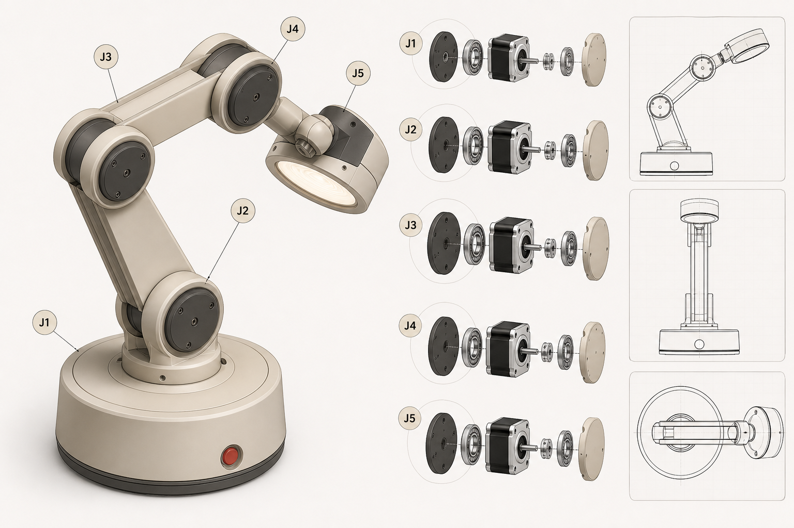

# 五轴闭环步进阅读伴侣灯：概念图 V1

这张图定义的是外形与关节布置，参考用户提供视频的低重心、短粗连杆、圆形关节语言；并明确采用闭环步进电机的同轴中置方案。

## 结构原则

- J1 为底座偏航；J2、J3 为两段灯臂俯仰；J4、J5 为灯头两自由度。
- 第一版每个关节使用 MKS SERVO42D CAN（首选有匹配手册的 V1.0.8）一体式闭环 NEMA17；电机本体位于关节轴向中间，尾部驱动 PCB 朝向连杆或底座腔体。
- 电机的转子轴与该关节旋转轴重合；不允许侧置电机、同步带、链条或外露减速器。
- 电机轴不可直接承受连杆弯矩。J1/J2/J3 用独立承载轴承座承担结构载荷；电机只传递转矩。J4/J5 至少需要电机前轴承加上一只外置承载轴承。
- J2/J3 在外观不变的情况下预留扭簧或恒力弹簧腔，以抵消灯臂重力矩并降低电机静态发热。

## 图中不是制造尺寸

在采购到电机前不要据此打印。下一版 CAD 需要根据实际实物测量确定：电机壳体长宽、轴径和伸出长度、编码器磁铁/驱动板空间、轴承型号、螺钉孔距、线束弯曲半径和限位机构。

建议先围绕一台实物 **MKS SERVO42D CAN（首选 V1.0.8）** 完成 J4/J5 单关节样件；确认壳体、承载轴承、走线及热管理后，再放大到 J1–J3。

> 注意：`joint_support_concept.svg` 是先前的淘汰草图，不可用于加工。当前结构以本文件和方案文档为准：MKS 电机轴线居中、尾部 PCB 向固定连杆收纳、关节负载由独立承载轴承结构承担。
