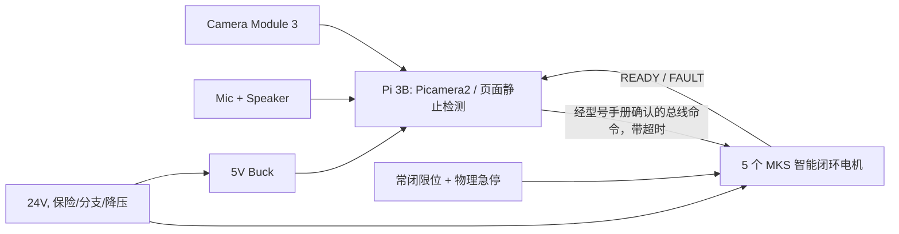

# 从概念蓝图到可验收的绘本伴侣灯

## 结论

附件的产品方向可行：固定式、低重心、带相机和语音的“表情型”阅读伴侣灯是合适的目标；但它并不是可直接照抄上电的工程方案。建议把第一版收敛为 **2 个低速表情轴 + 相机 + 语音 + LED**，在完成机械/电气/安全验收后再扩展至 5 轴。不要把它按六轴机械臂的动态指标来做。

## 必须修正的问题（阻塞项）

| 原文主张 | 问题 | 可执行修正 |
| --- | --- | --- |
| `SERVO42C + USB-RS485 + Modbus` 控制 5 轴 | 42C 与带 RS-485/Modbus 的 42D/57D 不是同一接口/协议系列。采购前不能假设可互换。 | 二选一：采购明确标示 **42D RS-485** 的同批固件产品；或保留 42C，但给每轴配经过电平/隔离设计的独立 UART，且按 42C 手册实现。 |
| Python 直接发送 5 ms 一帧 | Linux 与 USB 转串口不提供实时性；发送队列堆积会令“旧命令”在新目标之后执行。 | Pi 只发低频“目标姿态/动作段”；每轴驱动器或专用 MCU 负责插补、限速、超时失能。控制端保留最新目标，不使用无界 FIFO。 |
| 缺少回零/限位即可绝对运动 | 电机端编码器通常不是关节输出端绝对位置；减速器间隙与断电重启均会带来未知姿态。 | 每轴机械硬止挡、常闭限位开关与低速回零；在配置中保存软限位。绝不依赖“记忆上次角度”。 |
| 24 V/10 A 足够且安全 | 功率预算、保险丝、线径、浪涌、急停及 5 V 降压都没有设计。 | 电机、Pi/音频/LED 分电源支路；每支路保险；急停物理切断驱动器 EN 或动力接触器；24→5 V 选足额降压并共地策略经实测确认。 |
| KCF 直接跟“任意物体” | KCF 只跟初始化纹理框，遮挡/翻页/背景相似时会漂移；并不能识别绘本或给出可靠置信度。 | 第一版改为“手动框选/中心区域 + 静止检测”，仅用于触发拍照，绝不直接控制高速机构。绘本页识别使用图像哈希/人工确认，云端视觉仅在用户同意时调用。 |
| `cv2.VideoCapture(0)` 访问 Camera Module 3 | CSI 相机应走 libcamera/Picamera2；V3 也依赖该新相机栈。 | Raspberry Pi OS Lite + 系统包 `python3-picamera2`；用 Picamera2 采样，启动时检查相机、帧率和对焦。 |
| “全本地”同时调用 GPT-4o/edge-tts | 这是云端服务，且会把儿童图像/语音发送到第三方。 | 定义两种明确模式：离线模式只做本地提示音/预置内容；云端模式显示指示灯、获得监护人同意、最小化上传并自动删除缓存。 |

### 原附件示例代码的关键错误

1. `struct.pack('>BBHHBhh', ...)` 格式只接收 7 个字段，但原代码传入 8 个字段；异常被 `except Exception: pass` 吞掉，电机很可能完全没有执行且没有日志。
2. `0x10`（Modbus 写多个寄存器）帧的起始地址、数量、字节数和寄存器映射均未以实际型号手册确认，不能使用。
3. 文案说用了三次 `3t²-2t³`，实现却是线性插值；更重要的是队列发送时间远长于声明的 0.05 s，无法同步。
4. `last_positions` 在“已放入队列”时提前更新，传输失败或急停后会与真实姿态分离。
5. `cv2.TrackerKCF_create()` 的可用性取决于 OpenCV 构建版本；它没有重新捕获策略、置信度策略、相机资源释放或帧线程同步。
6. 主程序的 OpenAI 调用、函数缩进、`response.choices[0].message.content`、`if __name__ == '__main__'` 等均有语法/API 错误；`os.system`、固定 `temp.mp3` 和共享字典也存在并发及安全问题。

## 推荐的实际架构



**职责边界：** Pi 是交互主机和动作仲裁器；每台 MKS 是本机实时闭环控制器；机械限位和急停不依赖任何软件。第一版不增加 STM32；跨五轴同步通过“预置目标 + 经手册确认的同步启动机制”实现。若目标型号不支持同步启动，则只执行低速、保守的顺序动作，不能宣称精确多轴同步。

## 推荐 BOM（先做 2 轴 MVP）

| 类别 | 建议 | 验收条件 |
| --- | --- | --- |
| 机械 | 低重心钢/铝底座，短臂，轴承支撑，减速与机械止挡 | 断电时不会倾倒；手推不撞相机/夹手区 |
| 动力 | 24 V 有保护电源；每轴独立熔断；合格 24→5 V 降压 | 带负载时 5 V 不低于 Pi 的允许范围；线材不过热 |
| 轴 | MKS SERVO42D RS-485 一体式闭环 NEMA17；起步只装 pan/tilt 两轴 | 单轴连续低速 30 分钟，无过温、丢步和碰撞 |
| 安全 | 蘑菇头急停、常闭限位、驱动器 EN 硬切断、蜂鸣器 | 任何限位/急停在不依赖 Pi 的情况下失能 |
| 视觉 | Pi Camera Module 3 + 原厂 15-pin 排线 | Picamera2 稳定采集 640×480，测得实际帧率 |
| 声音 | USB/I2S 声卡、独立功放、小扬声器 | 语音播放时相机和 Pi 不重启、无明显电源噪声 |

## 执行器选型：已锁定的结构要求

本项目**不使用总线舵机、不使用外露同步带、不使用减速带**。第一版采用 **5 × MKS SERVO42D RS-485 一体式闭环 NEMA17**；电机本体位于圆关节的轴向中间，尾部 PCB 朝向连杆/底座腔体。PCB 在轴向尾部不等于电机轴线偏置，但这一版不具备后端双出轴。

| 位置 | 电机建议 | 结构要求 |
| --- | --- | --- |
| J1 底座偏航 | 42×48 mm，约 0.55 N·m，≤2 A/相 | 双侧承载轴承、软限位防缠线。 |
| J2 肩部俯仰 | 42×48 mm，约 0.55 N·m，≤2 A/相 | 电机轴线居中；扭簧/恒力弹簧抵消重力矩。 |
| J3 肘部俯仰 | 42×40 mm，约 0.40 N·m，≤1.5 A/相 | 电机轴线居中；预留弹簧与硬止挡。 |
| J4/J5 灯头 | 42×34 或 42×40 mm，0.25–0.40 N·m，≤1.5 A/相 | 同轴直驱、轻量灯头、独立承载轴承。 |

MKS SERVO42D 的集成驱动板提供编码器闭环、RS-485 通信与 I/O。外部承载结构仍必须有轴承和机械止挡；不能把结构负载长期压在电机自身轴承上。其通信协议仅按随货型号与固件手册实现。

## 分阶段验收（按顺序执行）

1. **桌面仿真**：运行本仓库测试；为每轴填写弧度软限位和速度上限。
2. **一轴通电**：断开机构，仅验证通讯、方向、急停和限位输入。每次只改变一个变量。
3. **一轴回零和动作**：低电流、低速，连续 100 次回零，记录最大重复误差与温度。
4. **两轴机械 MVP**：装相机和实体止挡，限制在安全工作空间；录制 3 个预置动作而非视觉实时跟随。
5. **视觉触发**：只检测“画面稳定 1.5 秒”，保存本地快照；失败时不产生运动。
6. **语音与隐私**：离线提示音先行。启用云端前设置物理联网开关/状态灯、监护人同意和缓存清理。
7. **扩至 5 轴**：每加一轴重复第 2–4 步，并重新核算底座、线束拖链和碰撞空间。

## 可借鉴而不应照搬的开源项目

- LeLamp 是很好的交互与外观参考，且已有 5 轴、Pi Camera、音频、LED 和录制/回放的总体结构；项目也明确仍处于 early development。其 GPL-3.0 许可要求衍生代码遵守相应许可义务。
- LeLamp Runtime 本身将电机设置/标定、硬件测试和录制回放分开，这个拆分值得保留；其 README 也警告长时间运行（超过约一小时）可能烧坏电机，故本方案把热保护和占空比测试列为验收项而非“可选优化”。
- 稚晖君 Dummy-Robot 值得借鉴的是：将实时运动控制放到 MCU、使用 CAN/UART、驱动器参数中显式包含关节范围/减速比、并区分 SEQ、INT、TRJ 三类控制模式。它的机械臂 DH/IK、谐波减速和上电校零方案不应直接搬到儿童桌面灯。
- MKS 的 42D/57D RS-485 文档明确该系列的 Modbus RTU 需单独启用；这是为什么必须以实际型号/固件手册建立协议测试的原因。42C 不能被假定为同款。

资料： [LeLamp](https://github.com/humancomputerlab/LeLamp)、[lelamp_runtime](https://github.com/humancomputerlab/lelamp_runtime)、[Dummy-Robot](https://github.com/peng-zhihui/Dummy-Robot)、[MKS 42D/57D RS-485 手册索引](https://www.manualslib.com/manual/3570985/Mks-Servo42d-Rs485.html)、[Raspberry Pi 相机文档](https://www.raspberrypi.com/documentation/accessories/camera.html)。
# 第一版 MKS 智能闭环架构（已锁定）

第一版执行器优先选用 **MKS SERVO42D CAN 版本，首选已具备对应手册的 V1.0.8**（或卖家能提供完全匹配手册的更新版本；不是 SERVO42C；不买 RS-485 版作为五轴主方案）。树莓派不产生 STEP 脉冲，也不承担电流环；每台 MKS 电机本身完成位置闭环与本地驱动。树莓派首选通过微雪 **隔离型 RS485 CAN HAT (B)** 的单路 CAN 下发高层关节目标；其 RS-485 通道第一版不使用。

```text
树莓派 3B：相机、页面静止判定、云端模型、语音、行为选择
    │  只发送高层意图 / 预先规划的关节目标
    ▼
树莓派运动服务：命令仲裁、动作时序、心跳监测、软件软限位
    │  CAN 总线 / 厂家 CAN 协议（按随货手册确认）
    ▼
五个 MKS SERVO42D CAN：相电流控制、编码器位置闭环、堵转/跟随误差故障
```

**谁写实时电机控制：**MKS 固件负责电流环、编码器纠偏和本机位置闭环；我编写树莓派上的命令仲裁、回零流程、故障状态机和五轴动作协调。只有未来改成普通外置 STEP/DIR 闭环驱动器时，才需要增加 STM32 来产生实时脉冲。

**下单验收清单：**商品标题和铭牌必须同时写明 `SERVO42D`、`CAN` 和固件版本；首选 `V1.0.8`，更新版本必须有完全匹配的随货手册。手册须明确包含 CAN 节点 ID、组/广播 ID、多电机同步控制、位置模式、速度/加速度、读编码器/速度/故障、心跳保护、IN_1/IN_2 限位和急停命令。购买 5 台同一批次、同一固件版本；另购 1 个**隔离型** CAN HAT 或 USB-CAN、总线两端 120 Ω 终端电阻、24 V 电源与硬件急停。先只买/接 1 台验证，再购齐其余 4 台是最稳妥的做法。

## 三种命令模式（借鉴 Dummy-Robot，必须保留）

| 模式 | 谁执行 | 新命令如何处理 | 本项目用途 |
|---|---|---|---|
| `SEQ`（顺序） | 树莓派命令队列 + MKS 本机轨迹 | 当前段的“完成反馈”到达后再执行下一段 | 点头、抬头、回到待机等离散表情动作 |
| `INT`（实时打断） | 树莓派立即下发覆盖/停止命令 | 清空 `SEQ` / `TRJ`，再发送新目标；受速度/软限位约束 | 相机发现书本移动、用户靠近、软件暂停 |
| `TRJ`（轨迹） | 树莓派有限长度缓冲区 + MKS 位置命令 | 定时消费；通信异常立即停止，不允许无限积压 | 后续录制回放、连续自然动作；第一阶段可暂不启用 |

安全优先级固定为：**硬件急停 > 驱动器故障/硬限位 > 树莓派通信/状态机故障 > INT > SEQ > TRJ**。任何时候急停或故障都清空三个软件命令通道并使所有电机失能；硬件急停不能依赖树莓派或总线。
